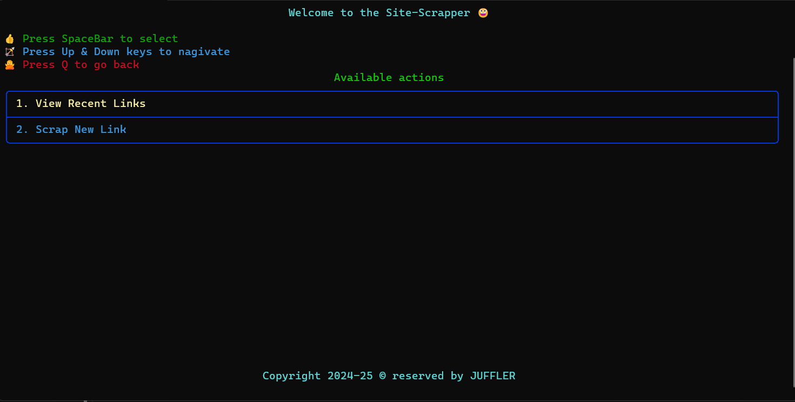
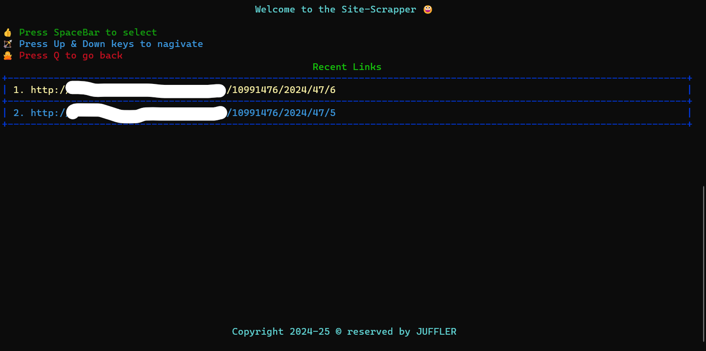
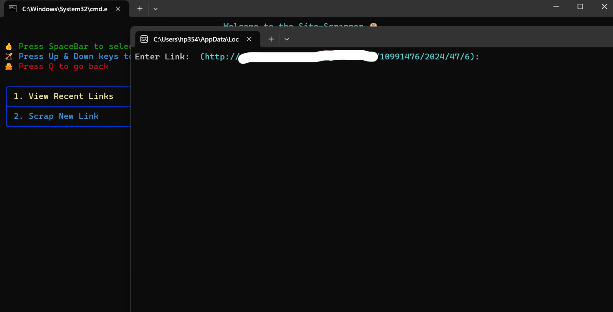
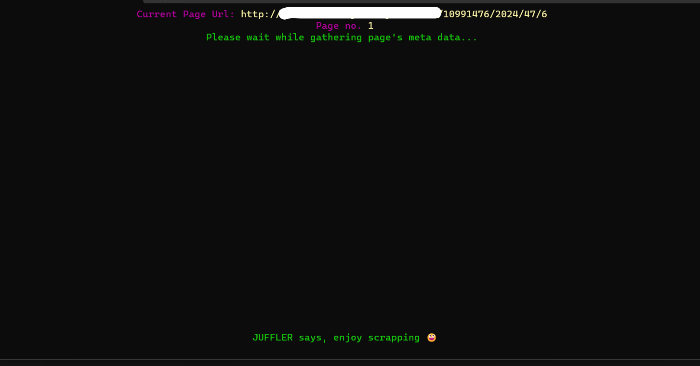
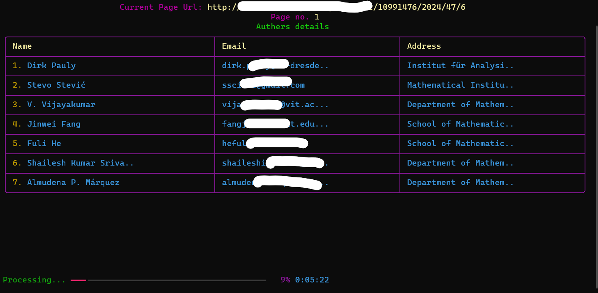

# Web Scraper CLI Application

Welcome to the README for the Web Scraper CLI Application! This CLI tool is designed to scrape articles from a specified website and extract author details. Below, you'll find all the necessary information to understand, set up, and use this application effectively.

## Features

- **Interactive Command Line Interface**: The application provides an interactive command line interface with arrow key navigation for easy menu interaction.
- **Beautiful UI Design**: Despite being a CLI application, this tool offers a beautiful and intuitive user interface (Rich lib used to build interface).
- **Recent Links Management**: Users can view and select from a list of recent links they've scraped, making it easy to revisit previous scrapes.
- **Scrape New Links**: Users can enter a new link to scrape articles from and view author details.
- **Progress Indicator**: The application displays a progress indicator while scraping articles, keeping users informed about the scraping progress.
- **Automatic Pagination Handling**: The scraper automatically handles pagination, navigating through multiple pages of articles to retrieve all available data.

## Screenshots

Here are some screenshots showcasing the UI of the application:

1.
2.  
3. 
4. 
5. 
 

## Setup Instructions

To set up the project locally, follow these steps:

1. **Clone the Repository**: Clone this GitHub repository to your local machine using the following command:
   ```
   git clone https://github.com/hitesh911/prathm-s_sitescrapper.git
   ```

2. **Navigate to the Project Directory**: Move into the project directory using:
   ```
   cd prath+tab
   ```

3. **Install Dependencies**: Install the required Python dependencies using pip:
   ```
   pip install -r requirements.txt
   ```

4. **Set Base Domain (Optional)**: Replace the `base_domain` variable in the `main.py` file with the domain of the website(if You know that). Note that the base domain has been removed from the source code due to security reasons. Without specifying a base domain, the application will not function properly.

5. **Run the Application**: Run the main Python script to start the application:
   ```
   python main.py
   ```

6. **Usage**: Follow the on-screen instructions to navigate through the application, scrape new links, or view recent links.

## Project Structure

The project structure is organized as follows:

- `main.py`: The main Python script containing the CLI application logic.
- `utils.py`: Utility functions used by the main script.
- `data.xlsx`: Excel file to store scraped author details.
- `recent.txt`: Text file to store recently scraped links.

## Contributors

This project was developed as a freelance project. Feel free to contribute to the project by opening issues or submitting pull requests.

## License

This project is licensed under the [MIT License](LICENSE). Feel free to use, modify, and distribute the code as per the terms of the license.

---

Thank you for using the Web Scraper CLI Application! If you have any questions, issues, or feedback, please don't hesitate to reach out. Happy scraping!
